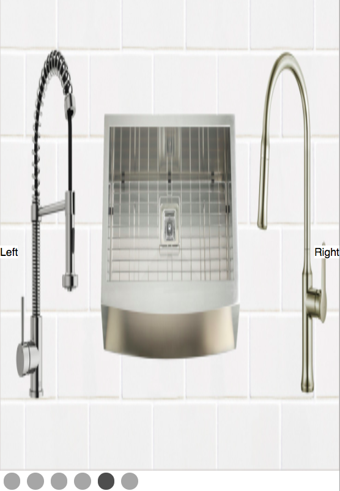

## Carasoul Component

# Getting it set up

<code>git clone https://github.com/kimhjona/carasoul-in-react.git</code>

<code>npm i</code>

<code>npm start</code>

# Notes.txt

I wrote this in 4 hours using create-react-app.

## Directions: 
Navigation - the image gallery will provide several ways for the user to navigate:
Autoplay - navigate to next image every 5 seconds automatically - if the user interacts with the carousel reset the 5-second clock
Left/right arrows - left arrow takes the user to the previous image,  the right arrow takes the user to the next image
Left and right arrow keys - the behavior should be the same as that outlined in the point above above
Bottom toggle - on the bottom of the carousel, there will be one dot per image; clicking on the second dot should take the user to the second image, etc
## Visual:
The left and right arrows are only shown to the user when they are hovering over the image carousel
On the first page, the left arrow will not be shown
On the last page, the right arrow will not be shown
The bottom dots should highlight the currently selected image
